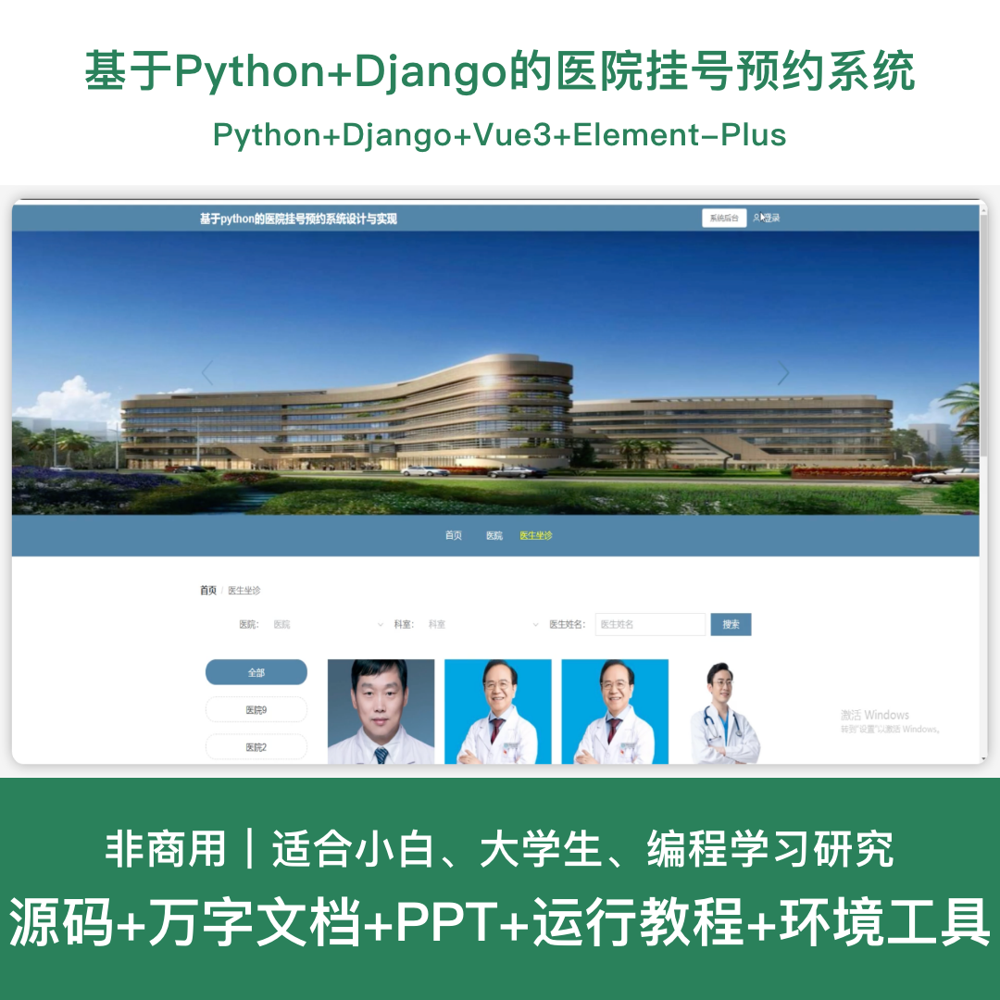
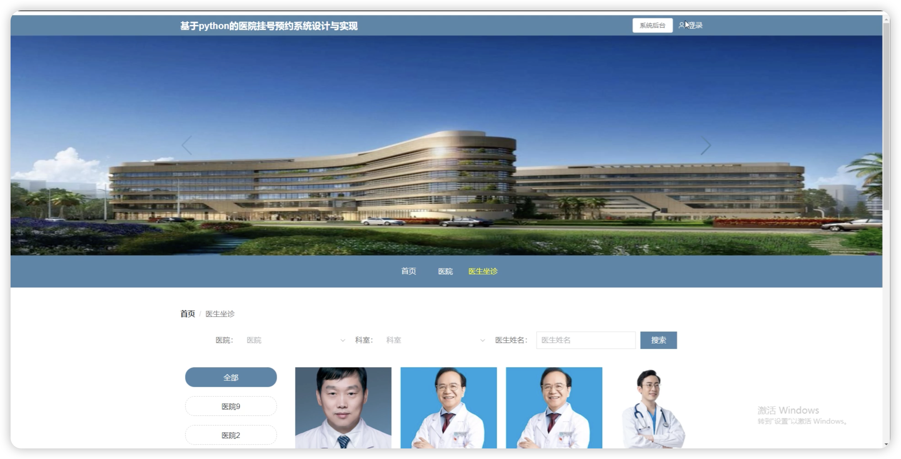
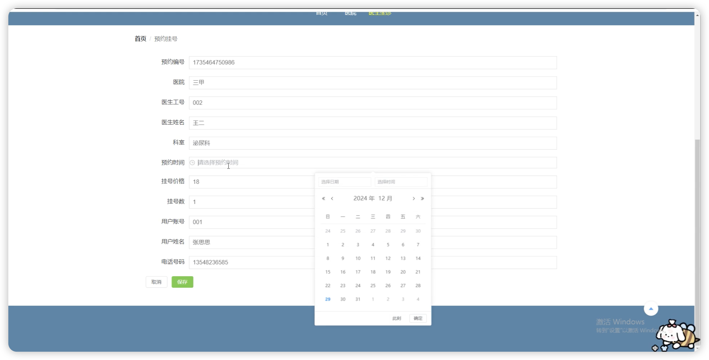
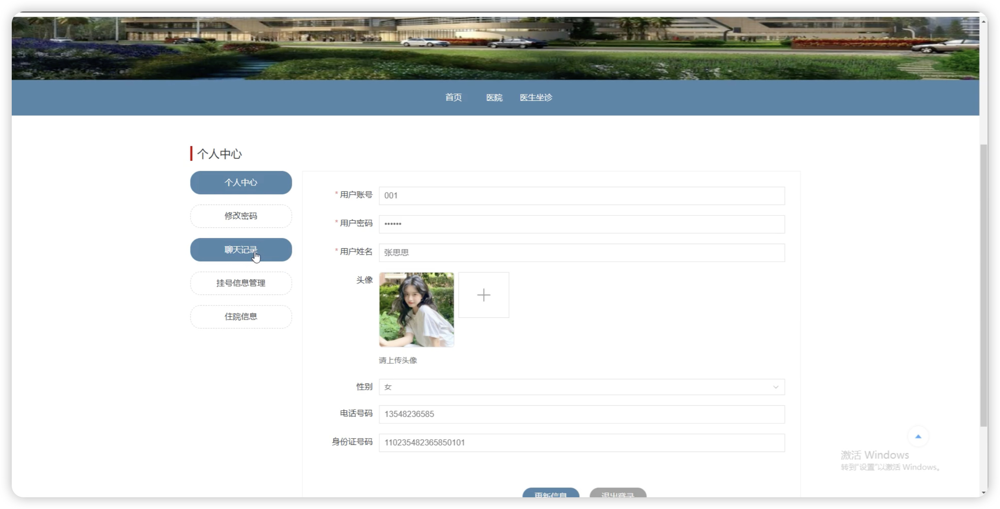
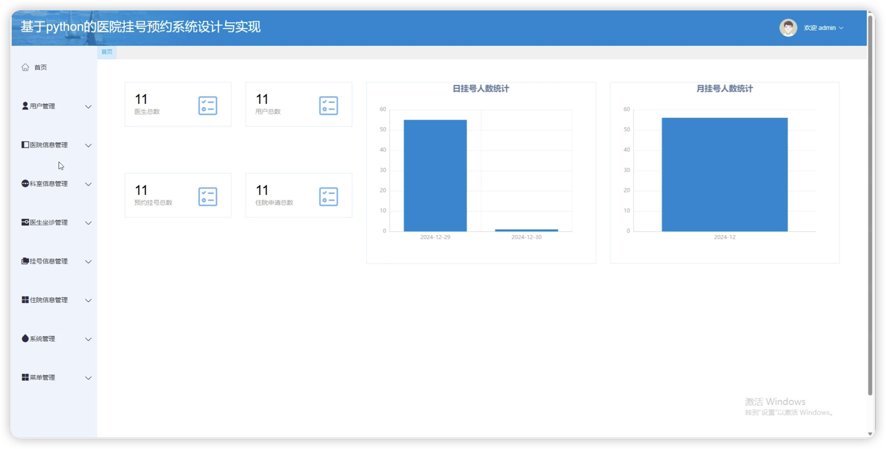
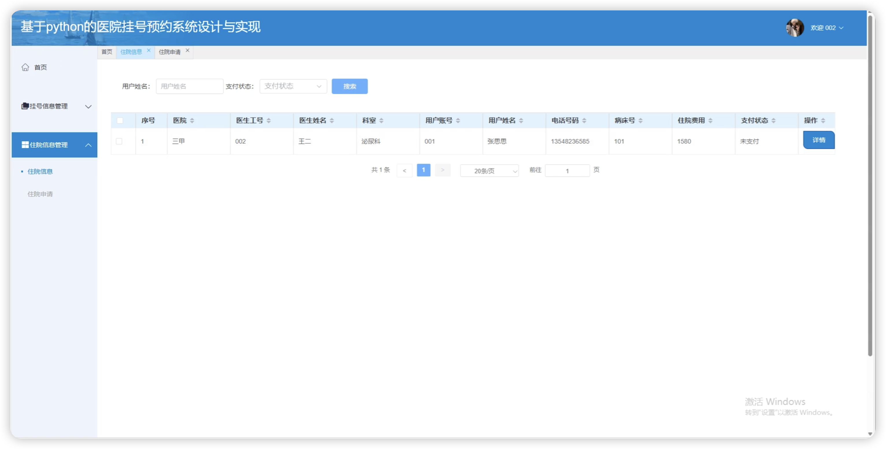
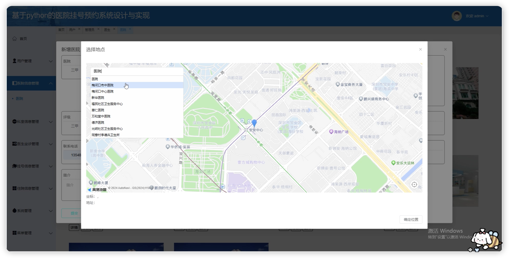
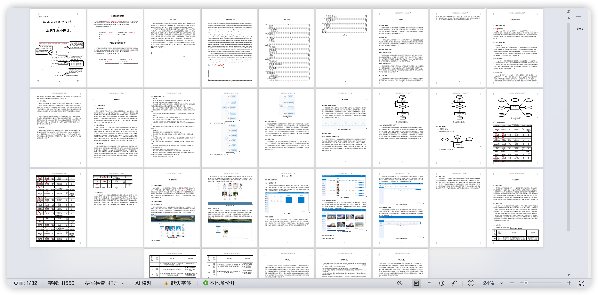

# python123D
python123D基于Python+Django的医院挂号预约系统+LW
 
## 源码问题查看主页咨询

### 一、关键词
医院挂号系统、预约挂号系统、医疗预约系统、就诊预约系统、门诊预约系统

### 二、作品包含
源码+数据库+万字设计文档+PPT+全套环境和工具资源+本地部署教程

### 三、项目技术
前端技术： Html、Css、Js、Vue3.2、Element-Plus
后端技术：Python、Django2.0、PyMySQL

### 四、运行环境（以下版本亲测，其他版本兼容性请自行测试）
开发工具：PyCharm + VSCODE

数据库：MySQL 5.7+

数据库管理工具：Navicat10以上版本

环境配置软件： Python 3.6

前端Nodejs：16+

浏览器：谷歌浏览器

### 五、项目介绍
项目编号：python123D

基于Python+Django的医院挂号预约系统，方便用户在线预约挂号，提升医院就诊管理效率。

角色：管理员、用户、医生

用户功能：注册登录、医院信息查询、科室信息浏览、医生坐诊查询、在线预约挂号、预约记录管理、住院申请、医嘱信息查看、个人中心。

医生功能：登录、坐诊信息管理、挂号记录查看、医嘱信息管理、个人中心。

管理员功能：登录、用户管理、医生管理、医院信息管理、科室信息管理、医生坐诊管理、预约挂号管理、住院申请管理、住院信息管理、医嘱信息管理。

数据库表：15张

### 六、运行截图

